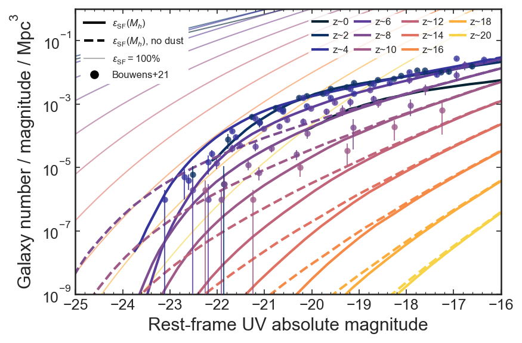
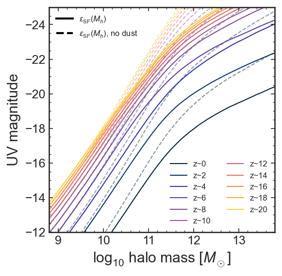

# UV luminosity functions
Mason, Trenti & Treu ([2015](https://ui.adsabs.harvard.edu/abs/2015ApJ...813...21M/abstract), [2022](https://ui.adsabs.harvard.edu/abs/2022arXiv220714808M/abstract)) UV luminosity function model 0 <= z <= 20

- `LF/` contains the UV LF model, both with and without dust attenuation and for ST and Reed+07 hmf (see [Assumptions](#assumptions) below). Columns are:

  1. Muv[mag]
  2. log10_Phi_max (100% efficiency LF)
  3. log10_Phi_dust
  4. log10_Phi_nodust
Phi units are #/mag/Mpc^3.

e.g. to plot the 'dust' model below at z=12 using the Reed+07 hmf use
```
z = 12
LF = np.genfromtxt(f'../../UVLF_model/LF/LF_z={z}_Reed07.txt') 
plt.semilogy(LF[:,0], 10**LF[:,2])
```


- `MUV_Mh/` contains the UV magnitude - halo mass relation, both with and without dust attenuation
Muv_Mh. Columns are: 

  1. logMh [Msun]
  2. Muv[mag]
  3. Muv_dust[Mag] (which includes dust attenuation following Mason+15 eqn 4)



## Assumptions
- We use [hmf](https://hmf.readthedocs.io/en/latest/) to calculate halo mass functions and use the Eisenstein & Hu 1998 (EH) transfer function as it works better than CAMB at [high z](https://github.com/halomod/hmf/issues/90)
  + We provide LFs calculated using both both [Sheth-Tormen](https://ui.adsabs.harvard.edu/abs/2001MNRAS.323....1S/abstract) and [Reed+07](https://ui.adsabs.harvard.edu/abs/2007MNRAS.374....2R/abstract) halo mass functions. These are almost identical at z<10, but at z>10 ST predicts a higher abundance of massive halos. Reed+07 hmfs were derived using N-body simulations at z~10-30.
- Flat LCDM cosmology with h=0.7, Om0=0.3,
- For z<10 we use metallicity = 0.02 Z_sun, z>=10 we use Z = 0.01 Z_sun

## Acknowledgement
If you use these models please include a citation to [Mason, Trenti & Treu (2015)](https://ui.adsabs.harvard.edu/abs/2015ApJ...813...21M/abstract) (for z < 10) and [Mason, Trenti & Treu (2022)](https://ui.adsabs.harvard.edu/abs/2022arXiv220714808M/abstract) (for z >= 10).
